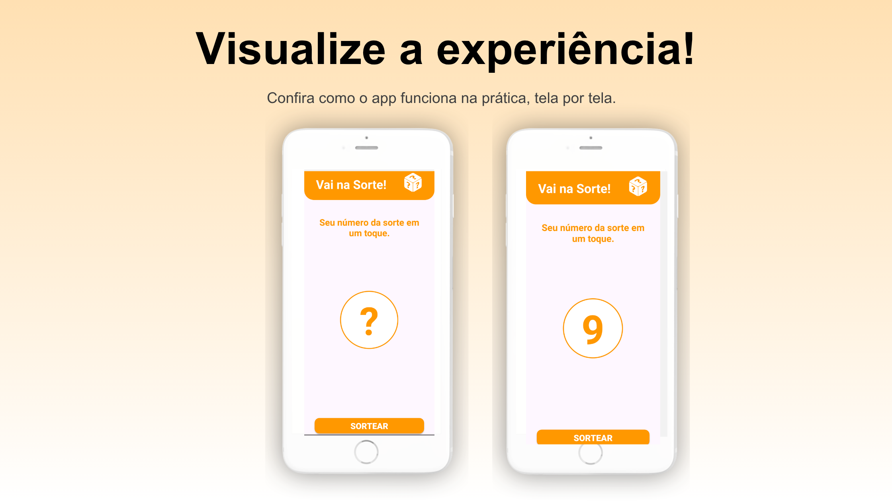

# 🎲 App de Sorteio

Este é um aplicativo simples que realiza o sorteio de números aleatórios entre 0 e 10 com apenas um clique. Desenvolvido com **Kotlin** no **Android Studio**, é uma ótima introdução ao desenvolvimento Android para iniciantes.

---

## ✨ Funcionalidades

- Gera um número aleatório entre 0 e 10  
- Interface minimalista e fácil de usar  
- Utiliza componentes básicos: `TextView`, `Button`  
- Manipulação de clique com `setOnClickListener`  
- Uso da classe `Random()` da linguagem Kotlin

---

## 📸 Imagens do Aplicativo

> Substitua pelos seus screenshots reais:

---

## 📱 Template de Apresentação

Este projeto foi apresentado utilizando o template gratuito:

🔗 [Creta – Slidecore Templates](https://slidecoretemplates.com/pt-pt/producto/creta-modelo-de-apresentacao-de-aplicativo-gratuito/#google_vignette)

## 📚 Sobre o Projeto

Este app foi desenvolvido como parte do **curso “Desenvolvimento Android com Kotlin”** ministrado por **Jamilton Damasceno** na plataforma **Udemy**. O objetivo do projeto é ensinar de forma prática o uso de elementos básicos da interface Android e lógica de programação em Kotlin.

---
